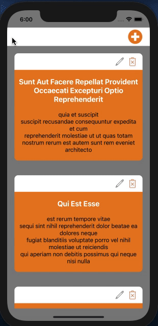
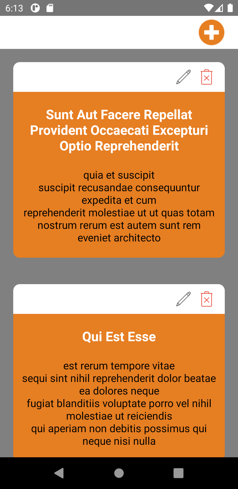
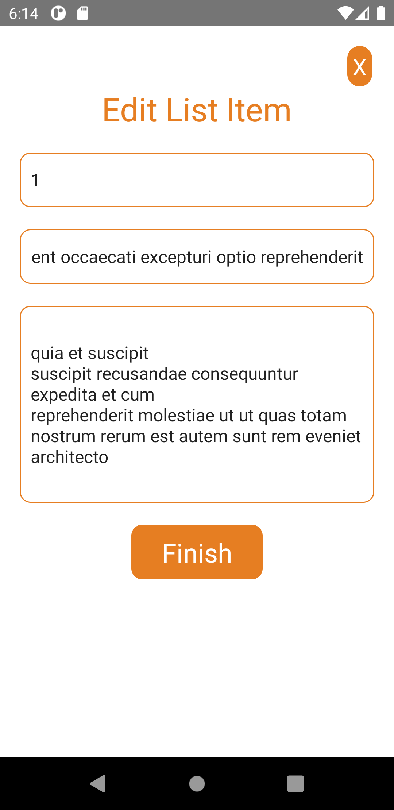
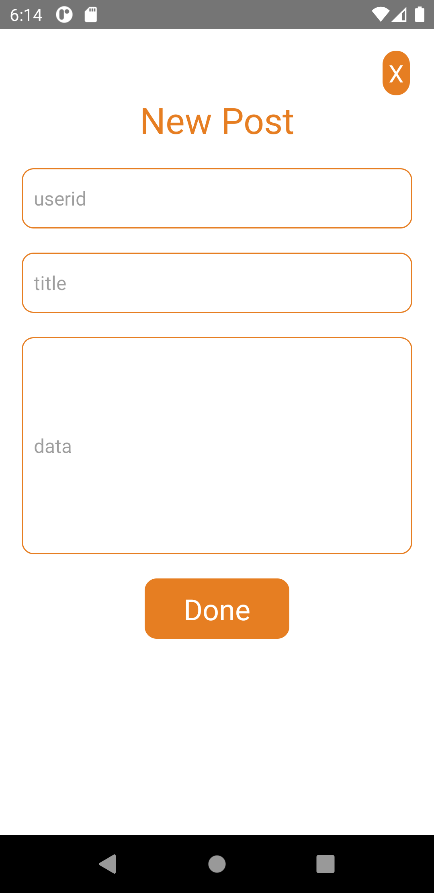

# Session: Redux Reducer

1. Create a Listing Screen with add icon on top right
2. Each List will have edit and delete icon use the respective API
3. All API's need to be implemented through redux.

## iOS
</img>

## Android
</img>
</img>
</img>